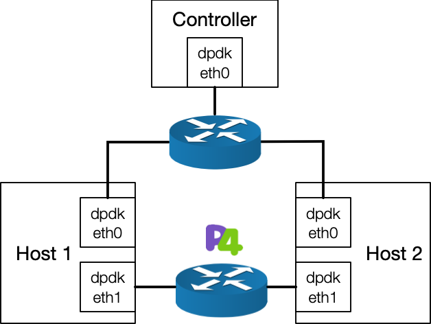
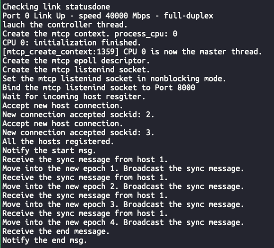
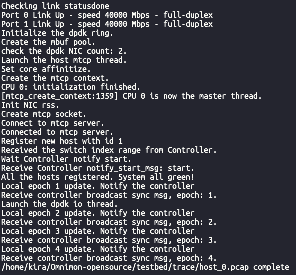
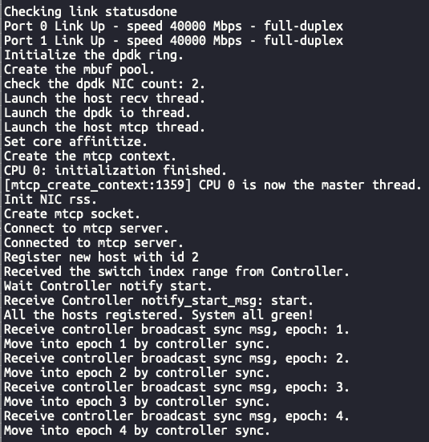
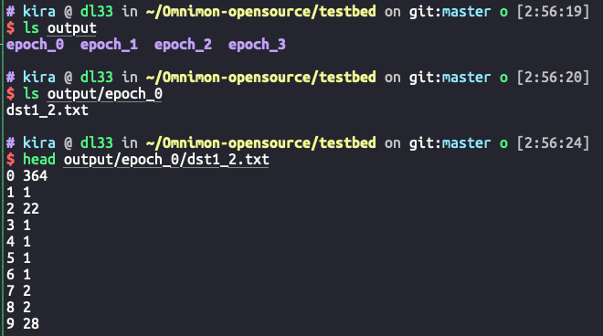
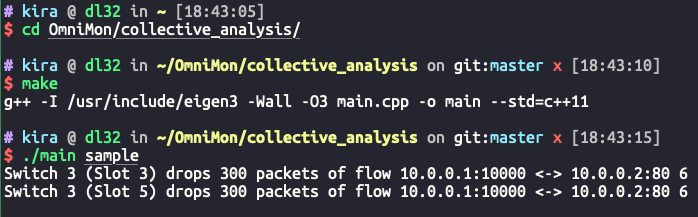

This repository contains 3 parts:

* Testbed programs, including:
  * End-host program
  * Controller program (collective analysis not included)
  * Dummy P4 program that can be run atop Tofino. We do not provide the full program due to the restriction of Barefoot NDA.
* MiniNet programs that simulate OmniMon
* Collective analysis that works for both testbed and MiniNet programs

# Part I: Testbed Programs

## Install Dependencies

We require the following depedencies to run OmniMon testbed programs.

* **cmake** >= 3.12
* **autoreconf:** `sudo apt-get install autoconf -y`
* **libpcap:**  `sudo apt-get install libpcap-dev -y`
* **libnuma:** `sudo apt-get install libnuma-dev -y`
* **libgmp:** `sudo apt-get install libgmp-dev -y`

* **iniparser**:

```bash
git clone http://github.com/ndevilla/iniparser.git
cd iniparser
make
sudo cp lib* /usr/lib/
sudo cp src/*.h /usr/include
```
* **mtcp**:

```bash
git clone https://github.com/mtcp-stack/mtcp.git
cd mtcp
git submodule init
git submodule update
sudo ifconfig eth0 down  # Suppose one dpdk NIC is eth0
sudo ifconfig eth1 down  # Suppose another one dpdk NIC is eth1
./setup_mtcp_dpdk_env.sh [<path to $RTE_SDK>] 
    - Press [15] to compile x86_64-native-linuxapp-gcc version
    - Press [18] to install igb_uio driver for Intel NICs
    - Press [22] to setup 2048 2MB hugepages
    - Press [24] to register the Ethernet ports
    - Press [35] to quit the tool
sudo ifconfig dpdk0 10.0.0.31/24 up   # Assign ip to the mtcp dpdk0, it is recommended to use 10.0.0.0/24 network segments
sudo ifconfig dpdk1 10.0.1.31/24 up   # Assign ip to the mtcp dpdk1, it is recommended to use 10.0.1.0/24 network segments

export RTE_SDK=`echo $PWD`/dpdk
export RTE_TARGET=x86_64-native-linuxapp-gcc
autoreconf -ivf
./configure --with-dpdk-lib=$RTE_SDK/$RTE_TARGET
make -j 4
```


## Hardware and Topology

Our testbed requires three servers and two switches, connected as shown in the figure below.



* Server: 

  * One server acts as the OmniMon controller, which requires one NIC that supports DPDK driver. ([Here](http://core.dpdk.org/supported/) lists the devices that can work with DPDK drivers)
  * The other two servers are used as sender and receiver, both of which need to have either two NICs or one dual-port NIC. All NICs need to support the DPDK driver. 

* Switch:

  * One switch is used to deploy the OmniMon dataplane program, which needs to support P4.

  * Another switch is used for the controller to connect the hosts in the network. 


## Included directories

The directory structure of our Omnimon testbed program is as follows:

* **bin**: compiled executable file directory
* **build**: intermediate result directory generated by cmake and compilation
* **config**: Omnimon configuration files
* **output**: the output directory generated when Omnimon running
* **p4**: the dummy P4 program which can run atop tofino
* **src**: Omnimon source code directory
* **trace**: a processed small-scale CAIDA trace for testing
* CMakeLists.txt


## Configure and Compile

OmniMon contains the following configuration files. You need to modify these files to compile and run the OmniMon testbed program. All the files are in the `${omnimon_dir}/testbed/config` directory.

1. **config.ini**    (the configuration file of OmniMon)

   The complete configuration parameters of OmniMon are shown in the table below. The option marked with * means that you have to set according to the operating environment.

   | Field            | Meaning                                                      |
   | ---------------- | ------------------------------------------------------------ |
   | **[Common]**     |                                                              |
   | ** * project_path**   | the absolute path of the Omnimon testbed project             |
   | trace_pcap_list  | file listing all raw pcap files                              |
   | key_len          | flow key length in bit (default 5-tuple)                     |
   | interval_len     | epoch length (default 100ms)                                 |
   | **[Host]**       |                                                              |
   | host_max_key     | max flows of each epoch in the test trace                    |
   | max_events       | mtcp events queue length                                     |
   | process_cpu      | the logical core id to run the mtcp thread (default 0)       |
   | **[Controller]** |                                                              |
   | ** * ip_addr**        | the ip address you assigned to dpdk0 of Controller when installing mtcp |
   | listen_port      | the listening port of Controller                             |
   | max_events       | mtcp events queue length                                     |
   | process_cpu      | the logical core id to run the mtcp thread (default 0)       |

2. **mtcp_om_[host/controller].conf**   (the configuration file of mtcp stack)

   We provide different configuration files for OmniMon's controller and host which are necessary for mtcp stack. Our program will automatically read the corresponding configuration file under the config directory and you have no need to modify the file content.

3. **arp.conf**     (required by mtcp stack)

   * **You need to list all MAC address of dpdk0 of each server after installing the mtcp stack.**

   * Mtcp thread will read the arp.conf automatically. Do not change the file path.

4. **route.conf**      (required by mtcp stack)

  * The route rules for mtcp stack. If you use the recommended network segment, you can directly use the file without modification.
  * Mtcp thread will read the route.conf automatically. Do not change the file path.


To compile the Omnimon executable files, you need to modify the `MTCP_DIR` variable in the **${omnimon_dir}/testbed/CMakeLists.txt** according to your environment at first.
```
set(MTCP_DIR <PATH to mTCP>)
```

After updating the CMakeLists.txt, you can compile the executable files using following commands on each server. The compilation result will be output to the `${omnimon_dir}/testbed/bin` directory. 

```bash
cd ${omnimon_dir}/testbed/build
cmake ..
make controller
make host_rx
make host_tx
```


## Setup Tofino

We provide a simple version of OmniMon data plane P4 program. The function of this program mainly includes parsing the header of OmniMon and completing the basic forwarding function. We now hide the counting part that requires the stateful ALU of Tofino, due to the Barefoot NDA. 

When the program is deployed, you need to configure the port and add the flow entry. Note that for the CAIDA trace we provide, we have added an Ethernet header to cooperate with our dummy P4 program for Layer 2 forwarding. The dst mac address is 9c:69:b4:60:ef:c9. You can use this address to add flow entry of the forward table.


## Run Controller

Make sure the current directory is `${omnimon_dir}/testbed`, run

```bash
sudo ./bin/controller config/config.ini
```

## Run End-Hosts

Make sure the current directory is `${omnimon_dir}/testbed`

On sender node, run:

```bash
sudo ./bin/host_tx config/config.ini 1
```

On receiver node, run:

```bash
sudo ./bin/host_rx config/config.ini 2
```


## Result Screenshots

We show the working process and output file of Omnimon testbed program in this part.
Here we have omitted a lot of output content of the mTCP stack.

We first run Omnimon's controller:



Next, we run host\_tx and host\_rx in sequence：
The running process of the host\_tx (sender) is shown in the figure:



The running process of the host\_rx (receiver) is shown in the figure:



After the program ends, the result file can be viewed in the `${omnimon_dir}/testbed/output` directory.  The following figure uses the receiver as an example.




# Part II: MiniNet Programs

We provide an OmniMon prototype based on Mininet and p4-behavioral model.

## Install Dependencies

We require the following dependencies to run OmniMon Mininet programs.

* **cmake** >= 3.12
* **libpcap:**  `sudo apt-get install libpcap-dev -y`
* **libzmq:** `sudo apt-get install libzmq3-dev`

* **iniparser**:

```bash
git clone http://github.com/ndevilla/iniparser.git
cd iniparser
make
sudo cp lib* /usr/lib/
sudo cp src/*.h /usr/include
```

For the Mininet and bmv2 environments, you can follow the instructions on the official site and install the dependencies easily.

```
bvm2    : https://github.com/p4lang/behavioral-model#dependencies
p4c     : https://github.com/p4lang/p4c#getting-started
Mininet : http://mininet.org/download/
```


## Mininet Topology

There are four hosts (h1, h2, h3, h4), three p4 switches (s1, s2, s3) and a controller(h5) in the network. The prototype consists of three parts, which run on the host, switch and controller, respectively.


## Included directories

The directory structure of our Omnimon Mininet program is as follows:

* **bin**: compiled executable file directory
* **build**: intermediate result directory generated by cmake and compilation
* **config**: Omnimon configuration files
* **output**: the output directory generated when Omnimon running
* **p4**: the dummy P4 program which can run atop bmv2
* **src**: Omnimon source code directory
* **trace**: a processed small-scale caida trace for testing

## Configure and Compile

You need to modify the following configuration files to compile and run the OmniMon Mininet program.

1. `mininet/P4/env.sh`

You should change the value of `BMV2_PATH` to the correct path of bmv2 folder

2. `mininet/config/config.ini` 

The complete configuration parameters of Mininet verison OmniMon are shown in the table below. The option marked with * means that you have to set according to the operating environment.

| Field             | Meaning                                  |
| ----------------- | ---------------------------------------- |
| **[Common]**      |                                          |
| * trace_dir       | directory of the test trace              |
| * trace_pcap_list | file listing all raw pcap files          |
| key_len           | flow key length in bit (default 5-tuple) |
| interval_len      | epoch length (default 100ms)             |

After modifying the configuration file, you can compile end_host and comtroller executable files using following commands.

```bash
cd ${omnimon_dir}/mininet/build
cmake ../src
make end_host 
make controller
```

## Start Mininet

*  Terminal-1 run the following command to start the simulated topologic and compile and run the P4 code of OmniMon: 

```bash
cd ${omnimon_dir}/mininet/P4
./run_bmv2.sh
```

* Terminal-2 run the following command to add flow_table for P4 switches in Mininet:

```bash
cd ${omnimon_dir}/mininet/P4
./set_switches.sh
```

## Run Controller

Terminal-1(with Mininet runnning on it) Run:

```bash
h5 ../bin/controller ../config/config.ini &
```

## Run End-Hosts

Terminal-1 Run:

```bash
h2 ../bin/receiver 2 &
h3 ../bin/receiver 3 &
h4 ../bin/receiver 4 &
h1 ../bin/end_host ../config/config.ini 1 
```

## Result Screenshots

When the program ends(as picture below shows), the end_host result will be automatically written in `mininet/output/hosts`.


To generate switch result, you need run following commands.

```bash
cd ${omnimon_dir}/mininet/P4
python read_register.py
```

 Switch result will also be written in `mininet/output/switch`.


# Part III: Collective Analysis

This repo implements the collective analysis of OmniMon individually.
The analysis program works for results generated by either testbed program or Mininet program.

## Dependencies

**libeigen**:  `sudo apt-get install libeigen3-dev -y`

## Prepare input files

Each epoch has a directory of input files for the analysis. These files are generated by switches and end-hosts.

The files include:

- device\_ids.txt: specify the ids of all end-hosts and switches
- path.txt: specify the expected path along which each flow travels
- src\_X: output file of each source end-host whose id is X. This file containing all flows sent from end-host X.
- dst\_X\_Y: output file of each destination end-host. This file includes flow values that are sent from end-host X and received by end-host Y.
- sX.txt: output of switch X.

We provide a simple sample in directory [collective\_analysis/sample].

## Compile and Run

1. Enter collective analysis directory:
```
cd collective_analysis
```

2. Compile
```
make
```

3. Run
```
./main [dir]
```
Here, dir is the input directory.

## Example

In our sample example, some packets of a flow are dropped by Switch 3. The result is:


